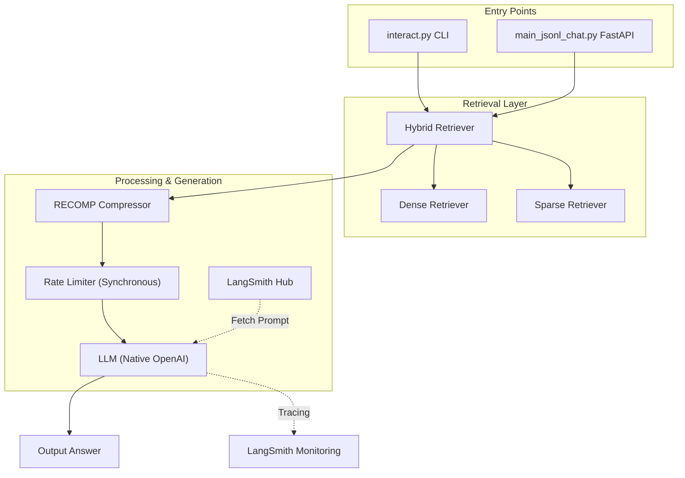

# Archival RAG System

A Retrieval-Augmented Generation (RAG) system for ingesting archival document corpora (JSONL format) and querying them with a hybrid retrieval pipeline backed by an LLM.


## Corpus Statistics

> **397 documents** spanning **638 years** (1299–1937) across **2 collections**.

### Collections

| Collection | Documents |
|---|---|
| `africa_and_new_imperialism` | 238 (59.9%) |
| `indiaraj` | 159 (40.1%) |

### OCR Quality

| Tier | Count | Share |
|---|---|---|
| 🟢 High (≥ 0.9) | 191 | 48.1% |
| 🟡 Medium (0.7–0.9) | 136 | 34.3% |
| 🔴 Low (< 0.7) | 70 | 17.6% |

Estimated OCR confidence scores: **mean 0.967**, median 0.979, std 0.038, range 0.606–0.996.

### Document Length (words)

| Statistic | Value |
|---|---|
| Mean | 38,859 |
| Median | 22,078 |
| Min / Max | 22 / 560,676 |
| P25 / P75 | 4,543 / 51,924 |
| P90 / P95 / P99 | 90,024 / 121,374 / 311,350 |


### Temporal Distribution

Documents span **19 decades** with the following concentrations:

| Period | Documents |
|---|---|
| Medieval (1290s–1310s) | 14 |
| Late 18th century (1760s–1790s) | 102 |
| 19th century (1800s–1890s) | 262 |
| Early 20th century (1920s–1930s) | 4 |
| **Peak decade** | 1860s (81 docs) |

## Total Number of Chunks

> **121,722 chunks** stored across all indexes (verified 2026-03-05).

### Storage Files

| File | Size | Purpose |
|---|---|---|
| `storage/ids.json` | ~4.7 MB | List of all 121,722 chunk IDs |
| `storage/docstore.jsonl` | ~154 MB | One chunk (text + metadata) per line — 121,722 lines |
| `storage/faiss.index` | ~187 MB | Dense FAISS vector index over all chunks |
| `storage/bm25_index.pkl` | ~139 MB | BM25 sparse index over all chunks |

**Total storage footprint: ~485 MB**

> All four storage artifacts are in sync at **121,722 chunks**.

## What This Project Does

The system allows you to:
1. **Ingest archival corpora** — Stream `.jsonl` files, chunk documents, embed with BGE, and store in a FAISS vector index
2. **Retrieve documents** — Three retrieval modes: Dense (semantic), Sparse (BM25 keyword), and Hybrid (RRF fusion)
3. **Query with an LLM** — Retrieved context is passed to LLaMA 3.1 70B via OpenRouter to generate answers.
4. **Evaluate Performance** — A dedicated evaluation suite to measure retriever accu## Architecture



## Interactive QA Mode

The project features a live command-line interface for real-time interaction with the RAG system. This is the primary way to test the system manually.

### Running Live QA
```bash
uv run interact.py
```

### Advanced Interactive Options
- **Enable Live Evaluation**: Run Ragas metrics (`Faithfulness`, `Answer Relevancy`) for every query.
  ```bash
  uv run interact.py --eval
  ```
- **Disable Compression**: Run without the RECOMP step.
  ```bash
  uv run interact.py --no-compress
  ```
- **Override Top-K**:
  ```bash
  uv run interact.py --top-k 15
  ```

## Evaluation Framework

The project includes a robust evaluation module to measure both search and generation quality.

### Supported Metrics
- **Retriever Metrics**:
  - **MRR** (Mean Reciprocal Rank): Measures rank quality of the first correct document.
  - **Recall@K**: Measures if the ground truth document is within the top $K$ results.
  - **nDCG**: Measures ranking efficiency and position sensitivity.
- **Generation Metrics (Ragas)**:
  - **Faithfulness**: Is the answer derived solely from the provided context?
  - **Answer Relevancy**: Does the answer directly address the user query?
  - **Context Precision/Recall**: Quality and completeness of the retrieved context.

### Running Evaluation
To run a full evaluation on the `rag_questions.json` dataset:
```bash
uv run evaluation/evaluate.py
```

### Evaluation Artifacts
- **Detailed Dataset**: `data/rag_dataset/rag_dataset.csv` — Inspect every query, context, and generated answer.
- **Summary Report**: `results/evaluation_results_[timestamp].json` — Quantitative summary of all scores.

## Dataset Generation

The project includes a synthetic dataset generation tool [create_queries.py](file:///e:/workspace/Archival_RAG_system/src/create_queries.py) to bootstrap evaluation.

### 1. Generating Queries
Uses an LLM to generate diverse retrieval and RAG questions from your corpus:
```bash
uv run src/create_queries.py --corpus data/corpus.jsonl --output data/queries/
```

### 2. Human Verification
Supports a "Human-in-the-loop" mode where specialists can approve or reject generated queries:
```bash
uv run src/create_queries.py --verify data/queries/
```

## Usage Summary

| Command | Purpose |
|---|---|
| `uv run interact.py` | Start the live, interactive RAG chat loop. |
| `uv run interact.py --eval` | Start live chat with real-time Ragas evaluation. |
| `uv run evaluation/evaluate.py`| Run the full evaluation suite against the test dataset. |
| `uv run src/create_queries.py` | Generate synthetic evaluation queries and Q&A pairs. |
| `uv run uvicorn main_jsonl_chat:app` | Start the FastAPI server for Inngest-based processing. |

## Project Structure

```
├── interact.py                 # Live Interactive CLI (Main Entry Point)
├── main_jsonl_chat.py          # FastAPI + Inngest functions (ingest & query)
├── evaluation/
│   ├── evaluate.py             # Main evaluation entry point (LangSmith integrated)
│   ├── metrics.py              # Mathematical IR metric implementations
│   └── trigger_evaluation.py   # Inngest trigger for async evaluation
├── src/
│   ├── create_queries.py       # Synthetic Dataset Generation & Verification
│   ├── config.yaml             # Centralized System Configuration
│   ├── generation.py           # LLM Handlers with Rate Limiting & Retries
│   ├── compressor.py           # RECOMP context compression (@traceable)
│   ├── prompts/
│   │   └── system_prompt.json  # Local fallback prompt template
│   ├── retrievers.py           # Dense, Sparse, and Hybrid Retrievers
│   ├── faiss_storage.py        # Persistent vector store
│   └── custom_types.py         # Pydantic models
├── data/
│   └── queries/                # Evaluation and test question sets
├── results/                    # Exported evaluation reports
├── storage/                    # Persistent FAISS and BM25 indices
└── pyproject.toml
```

## Quick Start

### 1. Install Dependencies

```bash
# Recommended with uv:
uv sync
```

### 2. Configure Environment

Create a `.env` file in the project root:

```env
# LLM Provider
OPENROUTER_API_KEY=your_key_here

# Monitoring & Prompt Hub
LANGSMITH_API_KEY=your_key_here
LANGSMITH_TRACING=true
LANGSMITH_PROJECT=archival-rag-evaluation
```

### 3. Run the System

**Option A: Interactive (Recommended for testing)**
```bash
uv run interact.py
```

**Option B: Server-based (For large ingestions)**
Terminal 1 — FastAPI server:
```bash
uv run uvicorn main_jsonl_chat:app
```

Terminal 2 — Inngest dev server:
```bash
npx inngest-cli@latest dev -u http://127.0.0.1:8000/api/inngest --no-discovery
```

Open the Inngest UI at `http://localhost:8288` to trigger and monitor events.

## Inngest Events

### Ingest a Corpus

```json
{
  "data": {
    "jsonl_path": "data/corpus2.jsonl",
    "source_id": "nls-corpus-v2"
  }
}
```

### Query the Corpus

```json
{
  "data": {
    "question": "Who fought at the Battle of Bara?",
    "top_k": 5,
    "retrieval_mode": "hybrid"
  }
}
```

`retrieval_mode` options: `"dense"` | `"sparse"` | `"hybrid"` (default)

**Response fields:**
| Field | Description |
|---|---|
| `answer` | LLM-generated answer |
| `sources` | Source document IDs used |
| `num_contexts` | Number of retrieved chunks |

### Inngest Pipeline Steps

Each query run is broken into 4 tracked steps:

| Step | Name in UI | What it does |
|---|---|---|
| 1 | `retrieval-dense` | FAISS vector search |
| 2 | `retrieval-sparse` | BM25 keyword search (cached index) |
| 3 | `retrieval-hybrid-merge` | RRF fusion of both results |
| 4 | `llm-answer` | LLM answer generation |

## Configuration

The system is configured via `src/config.yaml`. Key settings include:

| Section | Key | Description |
|---|---|---|
| **Retrieval** | `top_k` | Number of chunks to retrieve |
| | `embedding_model` | Model used for dense embeddings |
| **Generation** | `llm_model` | Model name (OpenRouter format) |
| | `rpm_limit` | Rate limit (Requests Per Minute) |
| | `max_retries` | Number of retries on API failure |
| | `hub_handle` | LangSmith Hub handle for prompts |
| **Compression** | `mode` | `none`, `extractive`, or `abstractive` |
| | `hub_handle` | LangSmith Hub handle for compressor prompt |
| | `extractive_model` | HF model for extractive compression |
| | `abstractive_model` | HF model for abstractive compression |

### Prompt Management
Prompt templates are managed via **LangSmith Hub**. 
- **Primary**: System pulls from `hub_handle`.
- **Fallback**: System uses local JSON files in `src/prompts/` (e.g., `system_prompt.json`).
